# SJCEM Navigator - Full Application Deep Dive

Last updated: April 1, 2026

This document is the complete technical walkthrough of the SJCEM Navigator project, including:
- Flutter app architecture and every source area in `lib/`
- Admin Panel architecture and all files in `Admin-Panel/`
- Database schema, functions, triggers, views, RLS, and storage setup
- End-to-end feature flows with Mermaid diagrams
- Platform wrappers, tooling, test status, config, and known gaps

---

## Quick Non-Technical Summary

SJCEM Navigator is a campus utility app that helps students and teachers do everyday academic tasks from one place.

At a high level, it gives users:
- Indoor room navigation inside college buildings.
- Class timetable visibility with current/next lecture awareness and reminders.
- Branch-level communication through chat and polls.
- Teacher location visibility based on timetable and manual status.
- A shared study-material repository organized by folders and subjects.

The Admin Panel is the control center used by faculty/admin teams to:
- Maintain teachers, students, branches, rooms, subjects, and timetable data.
- Run OCR-based imports to speed up data entry from timetable sheets.
- Monitor realtime updates and activity.
- Create backups and perform controlled restore operations.

In simple terms:
- Mobile app = day-to-day experience for students and teachers.
- Admin panel = operational dashboard to keep data accurate and up to date.
- Supabase backend = the live data engine powering both.

Who benefits:
- Students: faster navigation, fewer timetable surprises, easier communication.
- Teachers: visibility tools, announcements/polls, quicker academic coordination.
- Admin/HOD teams: centralized data operations with reduced manual overhead.

---

## Index

1. [Scope and Boundaries](#1-scope-and-boundaries)
2. [System Overview](#2-system-overview)
3. [Full Repository Coverage](#3-full-repository-coverage)
4. [Runtime Architecture and Lifecycle](#4-runtime-architecture-and-lifecycle)
5. [End-to-End Feature Flows](#5-end-to-end-feature-flows)
6. [Admin Panel Deep Dive](#6-admin-panel-deep-dive)
7. [Database Model Deep Dive](#7-database-model-deep-dive)
8. [Supabase Service Method Coverage Index](#8-supabase-service-method-coverage-index)
9. [Configuration Matrix](#9-configuration-matrix)
10. [Security and Operational Notes](#10-security-and-operational-notes)
11. [Known Gaps and Mismatches](#11-known-gaps-and-mismatches)
12. [Practical Developer Runbook](#12-practical-developer-runbook)
13. [Complete File Index by Area](#13-complete-file-index-by-area)
14. [Final Summary](#14-final-summary)

---

## 1. Scope and Boundaries

### 1.1 What is covered
- All first-party application source code.
- All first-party admin panel source code.
- SQL schema and admin SQL scripts.
- Project configuration files and support tooling.
- Web shell files and static assets directories.

### 1.2 What is intentionally excluded
- Generated build outputs under `build/` and `.dart_tool`-style generated artifacts.
- Third-party dependency source code in package managers.
- Binary assets are referenced, not reverse-engineered.

---

## 2. System Overview

SJCEM Navigator is a multi-surface system:
- A Flutter application for students and teachers.
- A browser-based Admin Panel built in plain HTML/CSS/JavaScript.
- A Supabase backend (PostgreSQL + Realtime + Storage).
- Firebase Cloud Messaging support for push channels.

### 2.1 High-level architecture

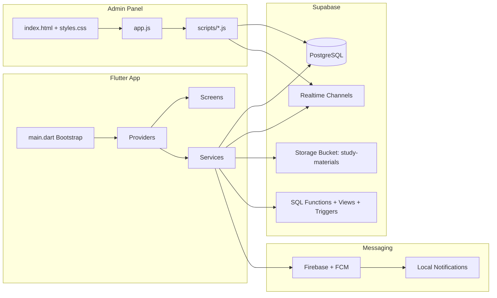

---

## 3. Full Repository Coverage

## 3.1 Root-level configuration and metadata

| File | Role in system |
|---|---|
| `README.md` | Main project readme with setup and feature summary. |
| `FULL_APP_DEEP_DIVE.md` | This complete deep-dive document. |
| `pubspec.yaml` | Flutter package/dependency configuration and asset registration. |
| `analysis_options.yaml` | Dart lint/analyzer config (`flutter_lints`, custom rule relaxations). |
| `devtools_options.yaml` | DevTools extension configuration shell. |
| `timetable.json` | Static timetable data payload/support artifact (binary/encoded file in repo). |

---

## 3.2 Flutter app coverage (`lib/`)

### 3.2.1 Entry point

| File | Coverage |
|---|---|
| `lib/main.dart` | App bootstrap: initializes performance config, system UI style, offline cache, dotenv, Supabase, Firebase, then runs `MultiProvider` + `MaterialApp` with `SplashScreen`. |

### 3.2.2 Models (`lib/models/`)

| File | Main model responsibilities |
|---|---|
| `lib/models/models.dart` | Barrel export for all models. |
| `lib/models/announcement.dart` | Announcement entity for notice-style content. |
| `lib/models/branch.dart` | Department branch entity. |
| `lib/models/chat_message.dart` | Branch chat message entity. |
| `lib/models/navigation_waypoint.dart` | Waypoint and connection entities for indoor graph navigation. |
| `lib/models/poll.dart` | Poll aggregate (`Poll`, `PollOption`, `PollVote`). |
| `lib/models/private_message.dart` | Direct message entity and conversation-level helper model. |
| `lib/models/room.dart` | Campus room entity including map coordinates and optional display metadata. |
| `lib/models/student.dart` | Student auth/profile entity including anonymous chat id and semester metadata. |
| `lib/models/study_file.dart` | Study material file metadata entity. |
| `lib/models/study_folder.dart` | Hierarchical folder entity for study repository. |
| `lib/models/subject.dart` | Subject entity including branch/semester/lab metadata. |
| `lib/models/teacher.dart` | Teacher profile entity with admin/HOD flags and location fields. |
| `lib/models/timetable_entry.dart` | Timetable slot entity with convenience getters for current/upcoming/time deltas. |

### 3.2.3 Providers (`lib/providers/`)

| File | State and orchestration responsibilities |
|---|---|
| `lib/providers/auth_provider.dart` | Login/register/logout flow, saved session restore, offline fallback session hydration, branch preload, notification listener startup. |
| `lib/providers/navigation_provider.dart` | Sensor fusion and movement state, map position updates, heading calibration, waypoint graph/path computation, admin map edit mode state. |
| `lib/providers/timetable_provider.dart` | Today/week timetable loading, offline fallback, current/next period calculation, countdown ticking, lecture reminder scheduling. |
| `lib/providers/chat_provider.dart` | Branch chat and private chat state, load/send actions, realtime subscriptions, private conversation scope handling. |
| `lib/providers/poll_provider.dart` | Poll load/create/vote flow, voted-state cache, vote status checks, realtime poll updates. |
| `lib/providers/teacher_location_provider.dart` | Teacher location map state, realtime location updates, per-teacher and global auto-location sync timers. |
| `lib/providers/study_materials_provider.dart` | Folder navigation, breadcrumb state, folder/file CRUD wrappers, upload actions, offline cache fallback. |

### 3.2.4 Services (`lib/services/`)

| File | Service responsibilities |
|---|---|
| `lib/services/supabase_service.dart` | Main backend API adapter. Covers auth-like table checks, CRUD for core entities, chat/polls/materials, navigation waypoints, teacher location RPC behavior, realtime channel builders. |
| `lib/services/offline_cache_service.dart` | SharedPreferences-based offline cache: timetable/rooms/waypoints/branches/teachers/polls/votes/chat/materials + connectivity checks + cache timestamps. |
| `lib/services/notification_service.dart` | Local notifications setup, Android channels, permission handling, realtime event listeners (chat/files/polls/private messages), lecture timer reminders, payload routing hooks. |

### 3.2.5 Screens (`lib/screens/`)

| File | UI responsibility |
|---|---|
| `lib/screens/splash_screen.dart` | Animated startup/splash orchestration and post-init route decision. |
| `lib/screens/auth/login_screen.dart` | Login experience for student/teacher entry. |
| `lib/screens/auth/register_screen.dart` | Student registration flow UI and form validation. |
| `lib/screens/home/home_screen.dart` | Main shell, dynamic tab construction by role, teacher auto-location start, timetable preload, floating action behavior. |
| `lib/screens/navigation/navigation_screen.dart` | Core indoor navigation UI, floor map rendering, path drawing, room and waypoint detail sheets, compass and position overlays. |
| `lib/screens/navigation/room_mapping_dialog.dart` | Room mapping admin dialog logic and map integration helper UI. |
| `lib/screens/navigation/waypoint_mapping_dialog.dart` | Waypoint mapping/connection dialog for admin editing tools. |
| `lib/screens/timetable/timetable_screen.dart` | Daily/week timetable visualizations, current/next class blocks, timing status UI. |
| `lib/screens/teacher/teacher_location_screen.dart` | Teacher location overview with room mapping and manual status interactions. |
| `lib/screens/chat/branch_chat_screen.dart` | Branch-wide chat UI with realtime updates and send flow. |
| `lib/screens/chat/private_chat_list_screen.dart` | Conversation list and entry point for private messages. |
| `lib/screens/chat/private_chat_screen.dart` | Direct chat interface and realtime thread updates. |
| `lib/screens/polls/polls_screen.dart` | Poll listing, vote actions, result visualizations (including chart painter logic). |
| `lib/screens/polls/create_poll_screen.dart` | Poll authoring UI for teacher/admin flows. |
| `lib/screens/study_materials/study_materials_screen.dart` | Folder browser, file list, navigation breadcrumbs, role-gated actions. |
| `lib/screens/study_materials/create_folder_dialog.dart` | Dialog UI for creating folders with metadata. |
| `lib/screens/study_materials/upload_file_dialog.dart` | Dialog flow for selecting and uploading study files. |

### 3.2.6 Utilities (`lib/utils/`)

| File | Utility responsibilities |
|---|---|
| `lib/utils/constants.dart` | Runtime constants and env-derived keys (supabase url/key/admin password), map dimensions, step length, user type constants. |
| `lib/utils/app_theme.dart` | App color palette, gradients, shadows, full theme definitions, decoration helpers, premium snackbar styling. |
| `lib/utils/animations.dart` | Navigation transitions, reusable animation widgets/builders, skeletons, pulse/checkmark/number/progress/typewriter effects, custom scroll physics. |
| `lib/utils/error_handler.dart` | Error normalization and user-facing message derivation helpers. |
| `lib/utils/hash_utils.dart` | SHA-256 password hashing and random anonymous id creation. |
| `lib/utils/kalman_filter.dart` | Kalman filters and sensor-fusion primitives for navigation signal smoothing. |
| `lib/utils/performance.dart` | Device profiling + optimized widget helpers for repaint and animation efficiency. |

---

## 3.3 Admin Panel coverage (`Admin-Panel/`)

### 3.3.1 Root files

| File | Responsibility |
|---|---|
| `Admin-Panel/index.html` | Full admin panel shell: auth card, dashboard shell, table area, KPI cards, OCR dialog, script loading order. |
| `Admin-Panel/styles.css` | Styling for auth shell, sidebar workspace, cards, tables, dialogs, dashboard analytics layout. |
| `Admin-Panel/app.js` | Primary registry and runtime coordinator: module catalog, permissions, nav building, activity logs, event binding, search/filter/render glue logic. |
| `Admin-Panel/README.md` | Admin panel setup, env loading behavior, deployment notes. |
| `Admin-Panel/package.json` | Build script wiring (`node generate-env.js`). |
| `Admin-Panel/netlify.toml` | Netlify build + publish directives. |
| `Admin-Panel/generate-env.js` | Build-time environment injection with password hashing and simple obfuscation for frontend-delivered keys. |
| `Admin-Panel/.env.example` | Plain env template for local/dev workflows. |
| `Admin-Panel/env.js.example` | Browser env template (`window.ADMIN_PANEL_ENV`) and local/deploy guidance. |

### 3.3.2 Script modules (`Admin-Panel/scripts/`)

| File | Responsibility |
|---|---|
| `Admin-Panel/scripts/core-env.js` | Parse env text, bootstrap from `env.js`, deobfuscate values, initialize Supabase client. |
| `Admin-Panel/scripts/auth-session.js` | Unlock/lock lifecycle, main-admin and panel-user authentication logic, role session setup. |
| `Admin-Panel/scripts/data-access.js` | Scoped query helpers, option/kpi loaders, CRUD wrappers, timetable/OCR helper DB calls, backup restore upsert accessors. |
| `Admin-Panel/scripts/dashboard.js` | Quick access cards, health indicators, chart rendering (Chart.js), analytics data load helpers. |
| `Admin-Panel/scripts/realtime-notifications.js` | Realtime subscription handling, branch scope filtering, debounce sync queue, heartbeat + health polling, notification center persistence. |
| `Admin-Panel/scripts/ocr-import.js` | OCR parsing for subjects/timetable (Tesseract pipeline), normalization, preview rendering, DB apply logic. |
| `Admin-Panel/scripts/backup-manager.js` | Full/single-table export (JSON/CSV), restore parsing and upsert flow, scheduled backup controls. |
| `Admin-Panel/scripts/ui-controller.js` | Toolbar behavior, module switch, table rendering, row select, bulk edit/delete, PDF export orchestration. |
| `Admin-Panel/scripts/editor-crud.js` | Dynamic form rendering from module schema, payload casting/validation, save/delete/refresh controller for CRUD forms. |

### 3.3.3 Admin module catalog implemented in code

Configured in `Admin-Panel/app.js`:
- `dashboard`
- `teachers`
- `students`
- `branches`
- `rooms`
- `subjects`
- `timetable`
- `polls`
- `poll_options`
- `teacher_subjects`
- `admin_panel_users`
- `activity_logs`
- `db_backup`
- `notices`

Note: `notices` exists in admin UI module config but is not present in `database/schema.sql` (which defines `announcements`). This is a documented gap section later.

---

## 3.4 Database coverage (`database/`)

| File | Responsibility |
|---|---|
| `database/schema.sql` | Full schema definition: core tables, constraints, migrations, functions, triggers, views, realtime publication, RLS, grants, storage setup. |
| `database/admin_panel_users.sql` | Admin panel auth tables/policies (`admin_panel_users`, `admin_panel_activity`) and grants for panel use. |

### 3.4.1 Core tables defined in `schema.sql`
- `branches`
- `students`
- `teachers`
- `rooms`
- `subjects`
- `teacher_subjects`
- `timetable`
- `branch_chat_messages`
- `private_messages`
- `polls`
- `poll_options`
- `poll_votes`
- `teacher_location_history`
- `navigation_waypoints`
- `waypoint_connections`
- `room_waypoint_connections`
- `announcements`
- `study_folders`
- `study_files`

### 3.4.2 SQL functions (selected key set)
- `update_vote_count`
- `update_updated_at_column`
- `log_teacher_location_change`
- `auto_update_teacher_location`
- `get_teacher_next_class`
- `auto_update_all_teacher_locations`
- `set_all_teachers_away`
- `get_teacher_scheduled_room`
- `update_room_display_name`
- `get_conversation_preview`
- `create_teacher`
- `increment_download_count`

### 3.4.3 Triggers
- Vote count update trigger on `poll_votes`.
- Updated-at triggers for `students`, `teachers`, `study_folders`, `study_files`.
- Teacher location history trigger on `teachers.current_room_id` updates.

### 3.4.4 Views
- `active_polls_with_stats`
- `todays_timetable`
- `current_ongoing_classes`
- `teachers_with_location`

### 3.4.5 Security and grants model in SQL
- RLS enabled on all major tables.
- Policies mostly open (`USING (true) WITH CHECK (true)`) because app uses custom table-driven auth with anon key flows.
- Broad grants to `anon` for tables/functions/views.
- Storage bucket and storage object policies for `study-materials`.

---

## 3.5 Test, tooling, web, assets, and platform wrappers

### 3.5.1 Test and tooling

| File | Responsibility |
|---|---|
| `test/widget_test.dart` | Default Flutter smoke test scaffold (counter style), currently not aligned with this app UI. |
| `tool/generate_icons.dart` | Script to generate placeholder icon/splash assets with `image` package drawing helpers. |

### 3.5.2 Web shell

| File | Responsibility |
|---|---|
| `web/index.html` | Flutter web host HTML and splash setup. |
| `web/manifest.json` | PWA metadata and icon declarations. |
| `web/icons/*` | PWA icon assets. |
| `web/splash/img/*` | Splash image variants by theme and density. |

### 3.5.3 Assets

| Folder | Responsibility |
|---|---|
| `assets/maps/` | Indoor floor map imagery used by navigation screen. |
| `assets/icons/` | App icon, splash icon, and related visual identity assets. |

### 3.5.4 Platform wrappers (Flutter host layers)

| Platform area | Notes |
|---|---|
| `android/app/src/main/...` | Android manifests/resources, splash/icon resources, and `MainActivity.kt`. |
| `ios/Runner/...` | iOS host app delegate, plist, launch and icon assets. |
| `windows/runner/...` | Windows desktop host entry and windowing wrapper files. |
| `linux/runner/...` | Linux host wrapper and app bootstrap files. |
| `macos/Runner/...` | macOS host wrapper files, entitlements, app icon assets. |

---

## 4. Runtime Architecture and Lifecycle

## 4.1 App startup sequence

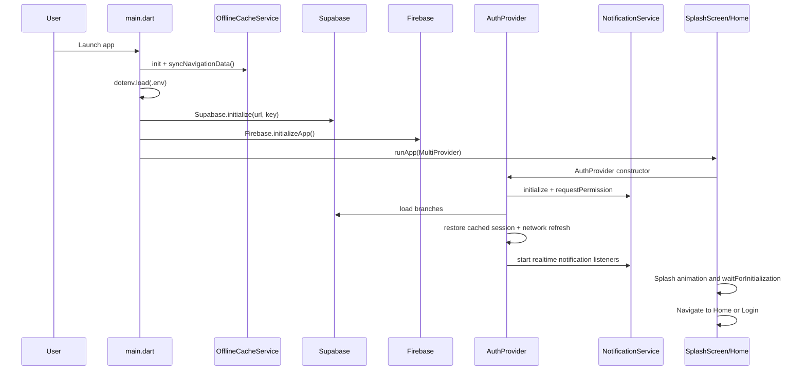

## 4.2 Provider-centric architecture

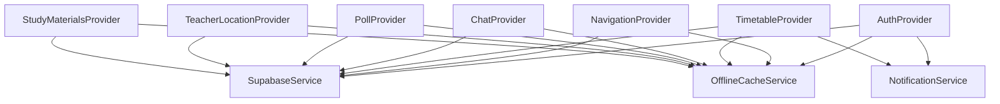

---

## 5. End-to-End Feature Flows

## 5.1 Authentication and session recovery

- Auth is custom table-driven (`students` and `teachers`) rather than Supabase Auth users.
- Passwords are SHA-256 hashed in client paths.
- Session keys and user metadata are persisted in SharedPreferences for offline recovery.

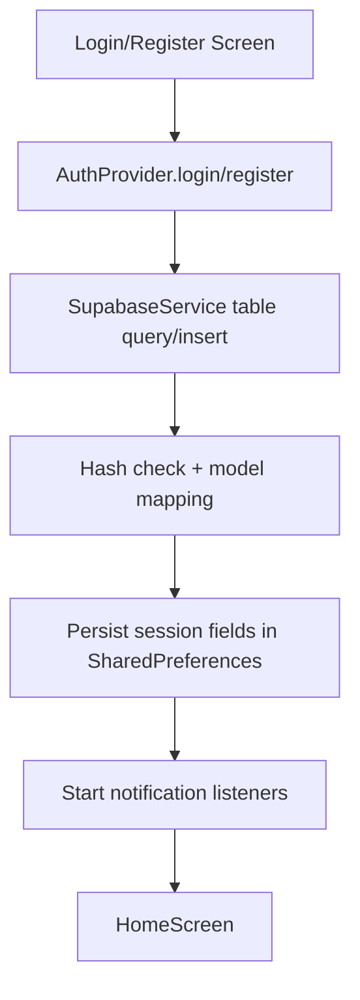

## 5.2 Indoor navigation

- `NavigationProvider` owns live position state, heading, step count, calibration state, admin edit mode state.
- Sensor stack uses accelerometer, magnetometer, gyroscope with Kalman/sensor-fusion smoothing.
- Waypoint graph and room-waypoint links support path computation.

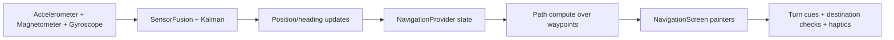

## 5.3 Timetable and lecture reminders

- Today/week load with branch/semester and optional batch filtering.
- Current and next period recalculated on timer.
- Lecture reminders scheduled via notification service.

## 5.4 Teacher location automation

- Realtime teacher row subscription updates map quickly.
- Auto location sync uses timetable + default room + staffroom fallback.
- SQL RPC/functions support global and per-teacher updates.

## 5.5 Chat (branch and private)

- Branch chat table: `branch_chat_messages`.
- Private message table: `private_messages`.
- Providers handle subscribe/unsubscribe lifecycle and send/read actions.
- Notification service listens for inserts and shows local notifications.

## 5.6 Polls

- Poll entity split across `polls`, `poll_options`, `poll_votes`.
- Provider tracks cached voted status to avoid duplicate votes.
- Realtime vote updates refresh poll counts.

## 5.7 Study materials

- Hierarchical folders in `study_folders` with parent-child chains.
- Files in `study_files` linked to folder and storage URL.
- Upload flow writes bucket object and DB metadata.
- Download count increment supported by SQL function and service helper.

## 5.8 Notifications

- Local channels: chat, file, lecture, general.
- Realtime subscriptions: chat messages, private messages, poll creation, file uploads.
- Optional FCM integration for broader push scenarios.

## 5.9 Offline behavior

- Connectivity checks via DNS lookup in `OfflineCacheService`.
- Cache keys for timetable, rooms, waypoints, branches, teachers, polls/votes, chat, study materials.
- Providers first attempt network, then fall back to cached payloads when available.

## 5.10 Working Algorithms (Detailed)

This section explains the core algorithms used by the app and admin panel in practical, implementation-level terms.

### 5.10.1 Indoor pathfinding algorithm (A* over waypoint graph)

Where implemented:
- `lib/providers/navigation_provider.dart` in `_computePath()` and `_findPath()`

How it works:
1. Convert user position and target room position to nearest waypoints.
2. Build adjacency list from `waypoint_connections`.
3. Run A* search:
  - `gScore` = actual cost from start.
  - `hScore` = Euclidean heuristic to target waypoint.
  - `fScore = gScore + hScore`.
4. Track parent pointers in `cameFrom`.
5. Reconstruct path by backtracking from end to start.
6. Prepend actual `start` point and append exact room point for a continuous route.

Complexity:
- Current implementation uses a Set for open nodes and linear minimum selection.
- Worst-case time is roughly `O(V^2 + E)` in dense traversal behavior.

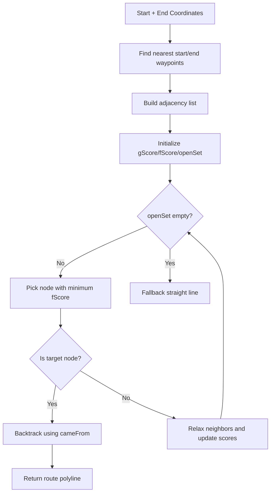

### 5.10.2 Position projection and corridor-constrained movement

Where implemented:
- `lib/providers/navigation_provider.dart` in `_nearestPointOnSegment()` and position-constraining flow

How it works:
1. For each waypoint connection segment on current floor, compute nearest point on the segment.
2. Use vector projection scalar `t`:
  - $$t = \frac{(P-A)\cdot(B-A)}{\|B-A\|^2}$$
3. Clamp `t` to `[0,1]` so the nearest point stays on segment.
4. Use nearest segment point to keep user trajectory aligned to corridors.

This reduces drift from dead-reckoning and prevents impossible off-corridor paths.

### 5.10.3 Step detection algorithm (adaptive peak-valley)

Where implemented:
- `lib/utils/kalman_filter.dart` in `SensorFusion.detectStep()`

How it works:
1. Low-pass filter accelerometer values.
2. Compute acceleration magnitude:
  - $$m = \sqrt{x^2 + y^2 + z^2}$$
3. Maintain history and baseline mean.
4. Compute deviation from baseline.
5. Compute adaptive threshold from standard deviation:
  - $$\sigma = \sqrt{\frac{1}{n}\sum (m_i - \mu)^2}$$
  - threshold is clamped to `[0.4, 2.0]`.
6. Peak-valley cycle confirms real walking pattern.
7. Enforce minimum interval (`250ms`) to avoid false double-steps.

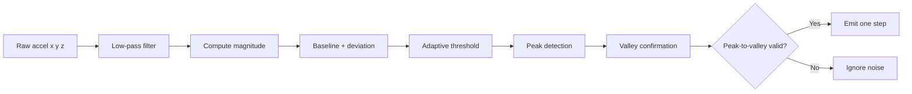

### 5.10.4 Sensor fusion and heading stabilization algorithm

Where implemented:
- `lib/providers/navigation_provider.dart`
- `lib/utils/kalman_filter.dart`

How it works:
1. Magnetometer heading is smoothed with circular mean.
2. Heading offset from calibration is applied.
3. Gyroscope integrates angular velocity for fast turn tracking.
4. Complementary filter blends gyro and magnetometer (high gyro weight during movement).
5. Heading buffer and threshold gating stabilize jitter.
6. Post-turn recalibration snaps heading to nearest corridor direction.

Result: stable direction arrow with responsive turn behavior.

### 5.10.5 Turn detection and junction recalibration algorithm

Where implemented:
- `lib/providers/navigation_provider.dart` in `_detectTurnAndMaybeRecalibrate()`, `_postTurnRecalibrate()`, `_cornerRecalibrate()`

How it works:
1. Track heading change per step.
2. If heading delta exceeds turn threshold, mark turning state.
3. After heading settles for configured steps, select nearest valid corridor segment.
4. Snap heading to corridor-aligned direction.
5. Update heading offset and gyro baseline to prevent cumulative drift.

This is critical for indoor corners and T-junctions where pure dead-reckoning drifts quickly.

### 5.10.6 Timetable current/next lecture scanning algorithm

Where implemented:
- `lib/providers/timetable_provider.dart` in `_updateCurrentAndNext()` and `_updateCurrentAndNextSilent()`

How it works:
1. Load sorted timetable entries.
2. Iterate entries once:
  - First match where `isCurrentPeriod` becomes `current`.
  - Next entry becomes `next`.
  - If no current, first `isUpcoming` becomes `next`.
3. Timer runs every second to update countdown UI.
4. Notification scheduling computes reminders based on configured minutes-before value.

Complexity:
- Single pass scan: `O(n)` per refresh.

### 5.10.7 Teacher auto-location state machine algorithm

Where implemented:
- `lib/providers/teacher_location_provider.dart` and SQL function `auto_update_teacher_location`

States used in runtime logic:
- `in_class`
- `in_break`
- `between_classes`
- `day_finished`
- `no_classes`

Decision logic:
1. If `in_class`, move teacher to scheduled room.
2. Else move to default room.
3. If no default room, move to staffroom fallback.
4. Global sync loop updates all teachers periodically.

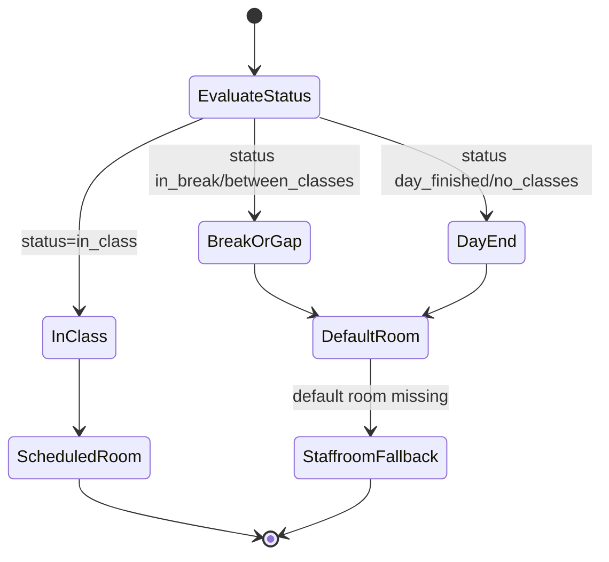

### 5.10.8 Poll vote counting algorithm

Where implemented:
- App side: `lib/providers/poll_provider.dart` and `lib/services/supabase_service.dart`
- DB side: `database/schema.sql` trigger `trigger_update_vote_count`

How it works:
1. App inserts a row into `poll_votes`.
2. DB trigger updates `poll_options.vote_count` atomically on insert/delete.
3. App refreshes poll payload and updates local state.
4. Realtime subscription pushes latest counts to all listeners.

This keeps aggregate counts consistent across clients.

### 5.10.9 OCR timetable parsing algorithm

Where implemented:
- `Admin-Panel/scripts/ocr-import.js` in `parseTimetableFromText()` and helpers

How it works:
1. Normalize OCR text lines.
2. Track current day by day headers.
3. Match time-range lines with regex.
4. Parse and normalize times to 24h format.
5. Infer period number per day incrementally.
6. Parse slot payload into lecture/practical/break segments.
7. Generate stable subject codes when missing.
8. Emit structured rows for preview and DB upsert.

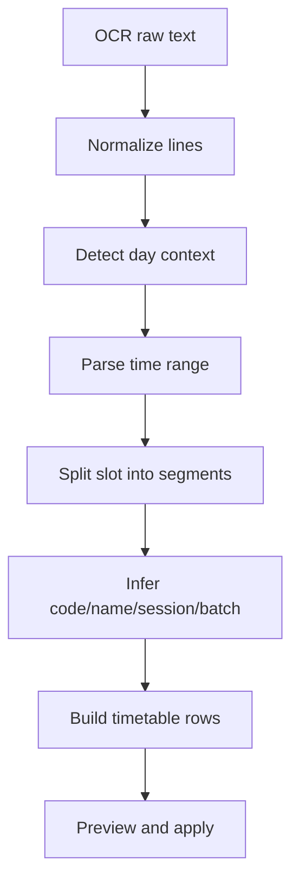

### 5.10.10 OCR subject parsing and code generation algorithm

Where implemented:
- `Admin-Panel/scripts/ocr-import.js` in `parseSubjectsFromOcrText()` and `generateSubjectCodeFromName()`

How it works:
1. Skip header-like/noise lines.
2. Detect semester context from headings.
3. Extract credits and lab/practical markers.
4. Try explicit code extraction from line.
5. If missing code, generate deterministic code prefix + sequence.
6. Prevent duplicates using a `seenCodes` set.

### 5.10.11 Admin realtime sync debounce algorithm

Where implemented:
- `Admin-Panel/scripts/realtime-notifications.js` in `queueRealtimeSync()` and `runRealtimeSync()`

How it works:
1. Incoming realtime events push table names into `pendingTables` set.
2. Start one debounce timer (250ms) if none active.
3. When timer fires, run a single refresh batch.
4. If a refresh is already in progress, set `syncQueued=true` and rerun after completion.
5. Option cache reload is conditional only for impacted table groups.

Benefits:
- Coalesces event storms.
- Avoids duplicate dashboard reloads.
- Keeps UI responsive while staying eventually consistent.

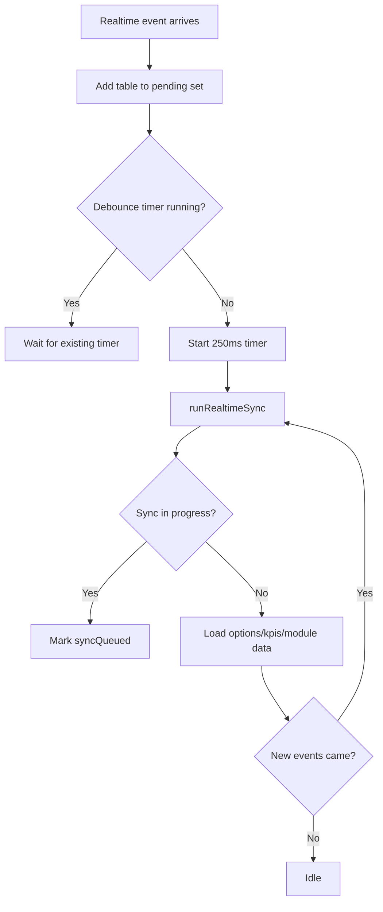

### 5.10.12 Backup and restore chunk-upsert algorithm

Where implemented:
- `Admin-Panel/scripts/backup-manager.js`
- `Admin-Panel/scripts/data-access.js` (`dbUpsertRestoreChunk`)

How it works:
1. Parse restore payload into table-wise batches.
2. Validate table presence and shape.
3. For each chunk, run upsert by primary key conflict handling.
4. Track progress and show user status in UI.

This strategy allows idempotent restore retries and partial recovery.

### 5.10.13 Chat message consistency algorithm

Where implemented:
- `lib/providers/chat_provider.dart`

How it works:
1. Load base message list from API.
2. Subscribe to realtime inserts.
3. For private chat, append only if message belongs to current conversation.
4. Deduplicate by message id before adding to list.

This prevents duplicate renders when load+realtime overlap.

### 5.10.14 Study-material tree traversal algorithm

Where implemented:
- `lib/providers/study_materials_provider.dart`

How it works:
1. Maintain `currentFolderId` and breadcrumb stack.
2. On folder open, load:
  - subfolders
  - files
  - folder path
3. Breadcrumb click jumps directly to that ancestor folder.
4. Offline cache can reconstruct prior folder snapshots by folder-key.

---

---

## 6. Admin Panel Deep Dive

## 6.1 Login model and roles

### Main admin
- Username empty or `main` mode.
- Verifies against `ADMIN_PASSWORD_HASH` (preferred), then legacy `ADMIN_PASSWORD`, then fallback constant.
- Full module access.

### Department users
- Login via `admin_panel_users` row.
- Password SHA-256 match in browser logic.
- Branch-scoped read/write depending on role (`teacher` read-only, `hod` elevated except panel user management).

## 6.2 Permission behavior by code

| Role | Access shape |
|---|---|
| Main admin | All modules + full CRUD including panel users. |
| HOD | Branch-scoped modules, can create/edit/delete in most modules, cannot manage `admin_panel_users`. |
| Teacher panel user | Mostly read-only branch-scoped view. |

## 6.3 Admin panel module map to DB

| Module key | Backing table |
|---|---|
| `teachers` | `teachers` |
| `students` | `students` |
| `branches` | `branches` |
| `rooms` | `rooms` |
| `subjects` | `subjects` |
| `timetable` | `timetable` |
| `polls` | `polls` |
| `poll_options` | `poll_options` |
| `teacher_subjects` | `teacher_subjects` |
| `admin_panel_users` | `admin_panel_users` |
| `activity_logs` | `admin_panel_activity` |
| `db_backup` | Multi-table export/restore workflow |
| `notices` | Configured in UI as `notices` table |

## 6.4 Realtime + health sync model

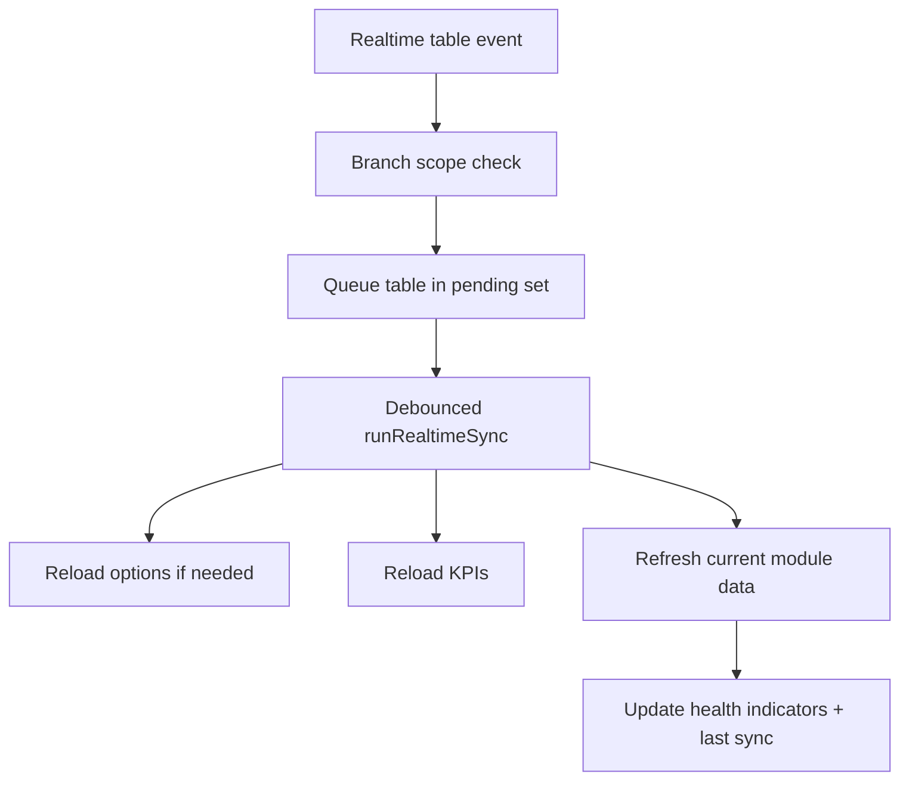

## 6.5 OCR import pipeline

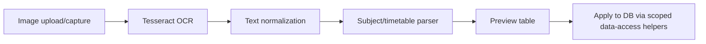

## 6.6 Backup and restore pipeline

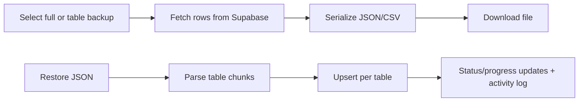

---

## 7. Database Model Deep Dive

## 7.1 Core relational map

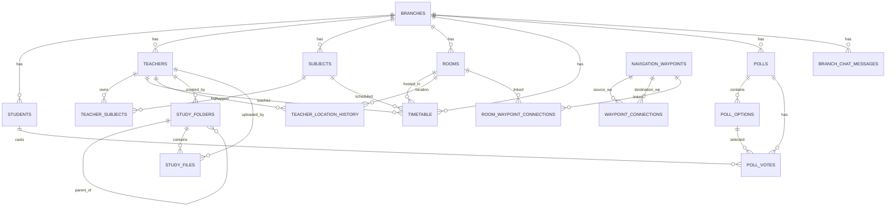

## 7.2 Runtime objects beyond base tables

- Views:
  - `active_polls_with_stats`
  - `todays_timetable`
  - `current_ongoing_classes`
  - `teachers_with_location`
- Triggers: vote count maintenance, teacher location logging, updated_at maintenance.
- RPC-style functions for location automation and conversation preview.
- Realtime publication adds key tables for push-style updates.

---

## 8. Supabase Service Method Coverage Index

The `SupabaseService` file is a large API surface. Major method groups:

### 8.1 Auth and identity methods
- `registerStudent`, `loginStudent`
- `registerTeacher`, `loginTeacher`
- `changeStudentPassword`, `changeTeacherPassword`

### 8.2 Core academic/location methods
- Branch/room/subject methods: `getBranches`, `getRooms`, `createRoom`, `updateRoom`, `updateRoomDisplayName`, `getSubjects`, `createSubject`, `updateSubject`, `deleteSubject`.
- Timetable methods: `getTimetable`, `getTodayTimetable`, `getTeacherTimetable`, `createTimetableEntry`, `updateTimetableEntry`, `deleteTimetableEntry`.

### 8.3 Teacher location automation methods
- `updateTeacherLocation`, `updateTeacherDefaultRoom`
- `getTeachersWithLocation`, `subscribeToTeacherLocations`
- `autoUpdateTeacherLocation`, `autoUpdateAllTeacherLocations`
- `getTeacherTimetableStatus`, `getTeacherNextClass`, `getTeacherBreakStatus`, `setTeacherInStaffroom`, `setTeacherAway`, `getStaffroomId`

### 8.4 Chat methods
- Branch chat: `getBranchMessages`, `sendBranchMessage`, `subscribeToBranchChat`
- Private chat: `getPrivateMessages`, `sendPrivateMessage`, `markMessagesAsRead`, `subscribeToPrivateMessages`, `getConversationPreviews`, `getConversationPreview`
- Directory helper: `getStudentsForChat`

### 8.5 Poll methods
- `getPolls`, `createPoll`, `vote`, `hasVoted`, `getVotedOption`, `refreshPoll`
- Teacher alert/statistics helpers: `notifyTeachersAboutPoll`, `getPollVoteDetails`, `getPollVotersDetails`, `subscribeToPollVotes`

### 8.6 Navigation graph methods
- `getWaypoints`, `getWaypointConnections`
- `createWaypoint`, `deleteWaypoint`
- `createWaypointConnection`, `deleteWaypointConnection`

### 8.7 Study materials methods
- Folder operations: `getRootFolders`, `getSubfolders`, `getFolderById`, `createFolder`, `updateFolder`, `deleteFolder`, `getFolderPath`
- File operations: `getFilesInFolder`, `uploadFile`, `createFileRecord`, `updateFile`, `deleteFile`, `incrementDownloadCount`, `searchStudyMaterials`

### 8.8 Admin-style helper methods
- Entity management: `getStudents`, `deleteStudent`, `getTeachers`, `deleteTeacher`, `deleteRoom`, `createBranch`, `updateBranch`, `deleteBranch`, `updatePoll`.
- Subject-teacher mapping: `getTeacherSubjects`, `assignTeacherSubjects`.

---

## 9. Configuration Matrix

## 9.1 Flutter app runtime config (`.env`)

Expected keys consumed by code:
- `SUPABASE_URL`
- `SUPABASE_ANON_KEY`
- `ADMIN_PASSWORD`

Resolved through `lib/utils/constants.dart` and loaded in `main.dart` before backend init.

## 9.2 Admin panel runtime config (`env.js` / build injection)

Primary browser object:
- `window.ADMIN_PANEL_ENV.SUPABASE_URL`
- `window.ADMIN_PANEL_ENV.SUPABASE_ANON_KEY`
- `window.ADMIN_PANEL_ENV.ONESIGNAL_APP_ID`
- `window.ADMIN_PANEL_ENV.ADMIN_PASSWORD` (local) or `ADMIN_PASSWORD_HASH` (build-generated)

Generation behavior:
- `Admin-Panel/generate-env.js` hashes password and writes obfuscated URL/key payload strings.

## 9.3 Build/deploy helpers
- `Admin-Panel/package.json`: build hook for environment generation.
- `Admin-Panel/netlify.toml`: deploy command and publish config.

---

## 10. Security and Operational Notes

### 10.1 Security posture in current codebase
- Password hashing uses SHA-256 in client code paths.
- Extensive use of anon-key + open RLS policies for operational simplicity.
- SharedPreferences caches are plain local storage values (not encrypted by app code).
- Admin panel login is browser-side table lookup + hash compare.

### 10.2 Trade-offs
- Fast implementation and easier custom auth flows.
- Weaker guarantees compared to strict server-side auth and restrictive RLS.

### 10.3 Recommended hardening direction
- Move to strict user-auth model (Supabase Auth or custom backend service layer).
- Tighten RLS policies per role/user context.
- Encrypt sensitive local cache payloads.
- Add immutable/tamper-resistant audit logging path.

---

## 11. Known Gaps and Mismatches

1. Admin module mismatch:
- Admin UI defines `notices` module and expects a `notices` table.
- `database/schema.sql` defines `announcements`, not `notices`.
- Action required: either create `notices` schema or rewire module to `announcements`.

2. Testing mismatch:
- `test/widget_test.dart` is default counter test scaffold and does not test real screens/providers.

3. README auth wording drift:
- Parts of README mention Supabase Auth, while runtime auth is custom table-based checks in `SupabaseService`.

---

## 12. Practical Developer Runbook

### 12.1 Flutter app
1. Create root `.env` with Supabase values.
2. Run `flutter pub get`.
3. Run `flutter run` on target device.

### 12.2 Database
1. Execute `database/schema.sql` in Supabase SQL editor.
2. Execute `database/admin_panel_users.sql` for admin panel users/activity.

### 12.3 Admin panel
1. Create `Admin-Panel/env.js` from `Admin-Panel/env.js.example` for local run.
2. Serve `Admin-Panel/` via static server.
3. For hosted deploys, use environment-injection build (`npm run build`).

---

## 13. Complete File Index by Area

This index is included so every source area is explicitly covered.

### 13.1 Flutter source files

- `lib/main.dart`
- `lib/models/announcement.dart`
- `lib/models/branch.dart`
- `lib/models/chat_message.dart`
- `lib/models/models.dart`
- `lib/models/navigation_waypoint.dart`
- `lib/models/poll.dart`
- `lib/models/private_message.dart`
- `lib/models/room.dart`
- `lib/models/student.dart`
- `lib/models/study_file.dart`
- `lib/models/study_folder.dart`
- `lib/models/subject.dart`
- `lib/models/teacher.dart`
- `lib/models/timetable_entry.dart`
- `lib/providers/auth_provider.dart`
- `lib/providers/chat_provider.dart`
- `lib/providers/navigation_provider.dart`
- `lib/providers/poll_provider.dart`
- `lib/providers/study_materials_provider.dart`
- `lib/providers/teacher_location_provider.dart`
- `lib/providers/timetable_provider.dart`
- `lib/screens/auth/login_screen.dart`
- `lib/screens/auth/register_screen.dart`
- `lib/screens/chat/branch_chat_screen.dart`
- `lib/screens/chat/private_chat_list_screen.dart`
- `lib/screens/chat/private_chat_screen.dart`
- `lib/screens/home/home_screen.dart`
- `lib/screens/navigation/navigation_screen.dart`
- `lib/screens/navigation/room_mapping_dialog.dart`
- `lib/screens/navigation/waypoint_mapping_dialog.dart`
- `lib/screens/polls/create_poll_screen.dart`
- `lib/screens/polls/polls_screen.dart`
- `lib/screens/splash_screen.dart`
- `lib/screens/study_materials/create_folder_dialog.dart`
- `lib/screens/study_materials/study_materials_screen.dart`
- `lib/screens/study_materials/upload_file_dialog.dart`
- `lib/screens/teacher/teacher_location_screen.dart`
- `lib/screens/timetable/timetable_screen.dart`
- `lib/services/notification_service.dart`
- `lib/services/offline_cache_service.dart`
- `lib/services/supabase_service.dart`
- `lib/utils/animations.dart`
- `lib/utils/app_theme.dart`
- `lib/utils/constants.dart`
- `lib/utils/error_handler.dart`
- `lib/utils/hash_utils.dart`
- `lib/utils/kalman_filter.dart`
- `lib/utils/performance.dart`

### 13.2 Admin panel files

- `Admin-Panel/index.html`
- `Admin-Panel/styles.css`
- `Admin-Panel/app.js`
- `Admin-Panel/README.md`
- `Admin-Panel/package.json`
- `Admin-Panel/netlify.toml`
- `Admin-Panel/generate-env.js`
- `Admin-Panel/.env.example`
- `Admin-Panel/env.js.example`
- `Admin-Panel/scripts/auth-session.js`
- `Admin-Panel/scripts/backup-manager.js`
- `Admin-Panel/scripts/core-env.js`
- `Admin-Panel/scripts/dashboard.js`
- `Admin-Panel/scripts/data-access.js`
- `Admin-Panel/scripts/editor-crud.js`
- `Admin-Panel/scripts/ocr-import.js`
- `Admin-Panel/scripts/realtime-notifications.js`
- `Admin-Panel/scripts/ui-controller.js`

### 13.3 Database, test, tool, and web files

- `database/schema.sql`
- `database/admin_panel_users.sql`
- `test/widget_test.dart`
- `tool/generate_icons.dart`
- `web/index.html`
- `web/manifest.json`
- `web/icons/*`
- `web/splash/img/*`

---

## 14. Final Summary

SJCEM Navigator is a rich, provider-driven Flutter system tightly integrated with a Supabase backend and accompanied by a capable browser Admin Panel that includes scoped access control, realtime sync, OCR-assisted imports, and backup/restore workflows.

The architecture already supports:
- Multi-domain academic workflows (navigation, timetable, chat, polls, materials)
- Realtime updates and local notifications
- Offline read fallback for key modules
- Admin-side operational tooling

The biggest architecture-level items to resolve next are schema alignment (`notices` vs `announcements`), stronger auth/RLS hardening, and replacement of placeholder tests with real integration/unit coverage.